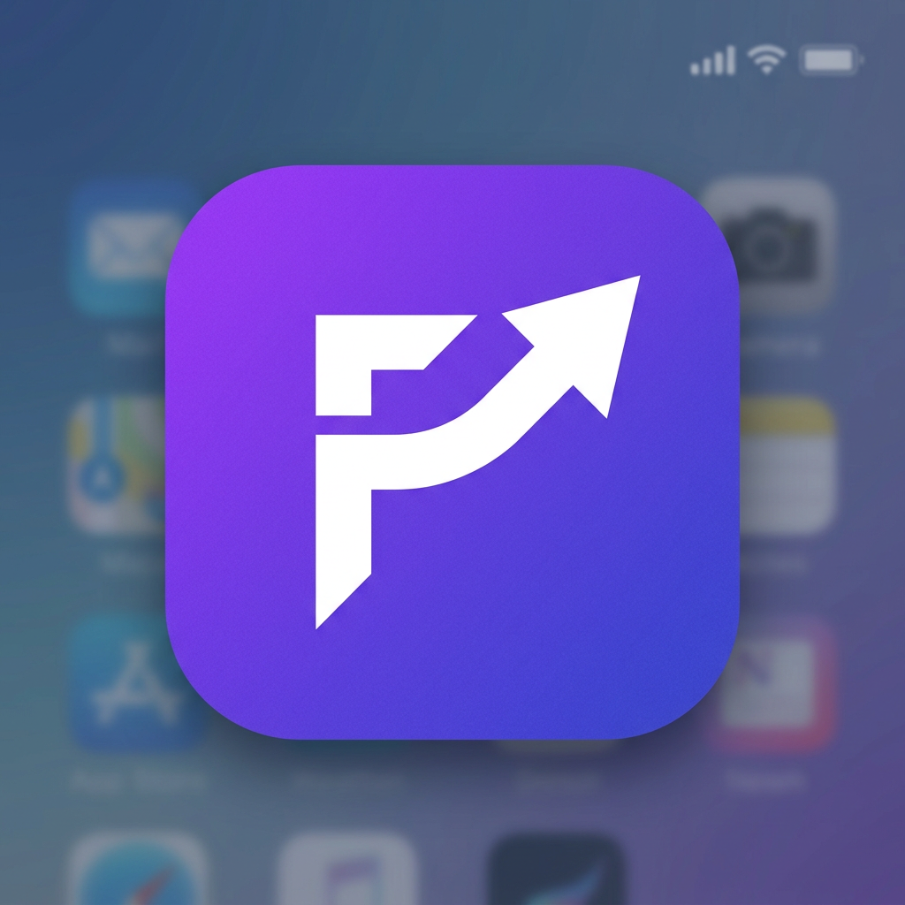

# FinMate – Personal Finance Manager

<p align="center">
  
</p>

<p align="center">
  <strong>Aplikasi keuangan personal berbasis PWA dengan AI Assistant.</strong><br/>
  React · TypeScript · Tailwind CSS · Supabase · Zustand
</p>

---

## Fitur Utama

| Fitur | Deskripsi |
|---|---|
| **Dashboard** | Ringkasan saldo, pemasukan/pengeluaran, grafik tren, pie chart kategori |
| **Transaksi** | CRUD lengkap, filter, search, grouped by date, 13 kategori expense + 6 income |
| **Akun Keuangan** | 6 tipe akun (Tunai, Bank, E-Wallet, Kartu Kredit, Investasi, Tabungan) |
| **Budget** | Per kategori, 4 periode (harian/mingguan/bulanan/tahunan), progress bar |
| **Financial Goals** | Target tabungan, progress tracker, estimasi harian, deadline countdown |
| **Hutang/Piutang** | Masuk ke saldo tapi TIDAK mempengaruhi pemasukan/pengeluaran |
| **Cicilan** | Tracking pembayaran berkala, auto-create expense saat bayar |
| **AI Chatbot** | Catat transaksi via natural language, analisis & saran keuangan |
| **Analitik** | Bar chart, line chart, pie chart, savings rate, rata-rata harian |
| **Dark/Light Mode** | Toggle di top bar |
| **Bilingual** | Bahasa Indonesia & English |
| **Offline-first** | LocalStorage default, Supabase sync opsional |
| **Google Login** | OAuth via Supabase |

---

## Quick Start

### 1. Clone & Install

```bash
git clone https://github.com/your-username/finmate.git
cd finmate
npm install
```

### 2. Jalankan Development Server

```bash
npm run dev
```

Buka `http://localhost:5173` di browser.

### 3. Build untuk Production

```bash
npm run build
```

File output di folder `dist/`. Bisa langsung deploy ke Vercel, Netlify, atau GitHub Pages.

---

## Setup Supabase (Opsional)

Aplikasi berjalan **100% offline** menggunakan localStorage secara default.  
Untuk sync data ke cloud dan login Google, ikuti langkah berikut:

### 1. Buat Project Supabase

1. Buka [supabase.com](https://supabase.com) dan buat project baru
2. Catat **Project URL** dan **Anon Key** dari Settings → API

### 2. Jalankan Database Schema

1. Buka SQL Editor di dashboard Supabase
2. Copy-paste isi file `supabase/schema.sql`
3. Klik **Run**

Ini akan membuat 6 tabel:
- `transactions` – Transaksi pemasukan/pengeluaran
- `accounts` – Akun keuangan
- `budgets` – Budget per kategori
- `goals` – Financial goals
- `debts` – Hutang & piutang
- `installments` – Cicilan

Semua tabel sudah dilengkapi **Row Level Security (RLS)** sehingga setiap user hanya bisa akses data miliknya sendiri.

### 3. Aktifkan Google OAuth

1. Di dashboard Supabase, buka **Authentication → Providers → Google**
2. Aktifkan dan masukkan Google OAuth Client ID & Secret
   - Buat di [Google Cloud Console](https://console.cloud.google.com/apis/credentials)
   - Authorized redirect URI: `https://<your-project>.supabase.co/auth/v1/callback`
3. Di **Authentication → URL Configuration**, tambahkan domain aplikasi Anda ke Redirect URLs

### 4. Konfigurasi di Aplikasi

1. Buka aplikasi FinMate
2. Masuk ke **Settings → Database & Login**
3. Masukkan **Supabase URL** dan **Anon Key**
4. Klik **Simpan Supabase**
5. Klik **Login dengan Google**

---

## Setup AI Assistant (Opsional)

AI Assistant membutuhkan API endpoint sendiri.  
Aplikasi mengirim request ke URL yang Anda tentukan dengan format:

```json
POST {your-api-url}
Authorization: Bearer {your-api-key}
Content-Type: application/json

{
  "messages": [...],
  "temperature": 0.7,
  "max_tokens": 1024
}
```

Response yang diharapkan (format OpenAI-compatible):

```json
{
  "choices": [
    {
      "message": {
        "content": "..."
      }
    }
  ]
}
```

### Konfigurasi

1. Buka **Settings → AI Assistant**
2. Masukkan **API Key** dan **URL API**
3. Klik **Simpan AI**

Anda bisa menggunakan:
- OpenAI API langsung (`https://api.openai.com/v1/chat/completions`)
- Self-hosted proxy/gateway
- API wrapper custom Anda sendiri

---

## Struktur Project

```
finmate/
├── public/
│   ├── logo-192.png          # PWA icon 192x192
│   ├── logo-512.png          # PWA icon 512x512
│   └── manifest.json         # PWA manifest
├── supabase/
│   └── schema.sql            # Database schema & RLS policies
├── src/
│   ├── App.tsx                # Entry point
│   ├── main.tsx               # React mount
│   ├── index.css              # Global styles + dark mode
│   ├── types/
│   │   └── index.ts           # TypeScript interfaces & constants
│   ├── lib/
│   │   ├── supabase.ts        # Supabase client & auth
│   │   ├── ai.ts              # AI API integration
│   │   ├── storage.ts         # Data layer (localStorage + Supabase)
│   │   └── i18n.ts            # Translations (ID/EN)
│   ├── store/
│   │   └── useStore.ts        # Zustand global state
│   ├── components/
│   │   ├── Layout.tsx         # Sidebar + header
│   │   ├── ChatPanel.tsx      # AI chatbot panel
│   │   ├── Modal.tsx          # Reusable modal
│   │   ├── Icons.tsx          # SVG icons
│   │   └── NotionIcon.tsx     # Notion-style category icons
│   └── pages/
│       ├── Dashboard.tsx      # Overview + charts
│       ├── Transactions.tsx   # Transaction CRUD
│       ├── Accounts.tsx       # Account management
│       ├── Budgets.tsx        # Budget tracking
│       ├── Goals.tsx          # Financial goals
│       ├── Debts.tsx          # Hutang/piutang
│       ├── Installments.tsx   # Cicilan
│       ├── Analytics.tsx      # Advanced analytics
│       └── Settings.tsx       # Configuration
├── index.html
├── package.json
├── tsconfig.json
└── vite.config.ts
```

---

## Logika Bisnis

| Aturan | Penjelasan |
|---|---|
| **Cash Default** | Akun Cash dibuat otomatis dan tidak bisa dihapus |
| **Pemasukan** | Menambah saldo akun |
| **Pengeluaran** | Mengurangi saldo akun |
| **Hutang** | Uang dipinjam → +saldo. Saat lunas → -saldo. Tidak dihitung sebagai income/expense |
| **Piutang** | Uang dipinjamkan → -saldo. Saat lunas → +saldo. Tidak dihitung sebagai income/expense |
| **Cicilan** | Pembayaran bulanan membuat transaksi expense otomatis dengan kategori "Cicilan" |
| **Budget** | Hanya kategori pengeluaran, dihitung real-time dari transaksi |
| **AI Chat** | Draft transaksi harus dikonfirmasi user sebelum disimpan |
| **Kategori** | Fixed, tidak bisa diedit, untuk konsistensi laporan |
| **Offline** | Jika Supabase tidak dikonfigurasi, semua data di localStorage |

---

## Tech Stack

- **React 19** + **TypeScript**
- **Vite 7** (build tool)
- **Tailwind CSS 4** (styling)
- **Zustand** (state management)
- **Recharts** (charts/graphs)
- **Supabase** (auth + database, opsional)
- **date-fns** (date utilities)

---

## Deploy

### Vercel

```bash
npm i -g vercel
vercel
```

### Netlify

Upload folder `dist/` atau connect GitHub repo.

### GitHub Pages

```bash
npm run build
# Upload dist/ ke gh-pages branch
```

---

## License

MIT License. Silakan gunakan dan modifikasi sesuai kebutuhan.
